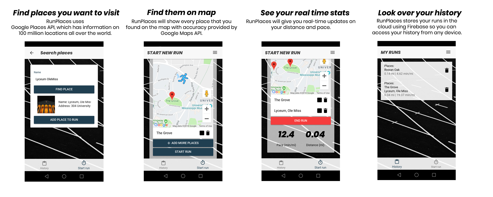

# MyGymLog
A class project I made to learn Hybrid Application Development - this project can be compiled to Website, Android or iOS app. 

## Description
Welcome to Run Places, the running app that will help you build your own picturesque route. Most running apps are tracking your route while you run and allow you to save that path. Run Places allows you to choose your path before your run. It allows you to search for any place : coffee shop, historical building or a beautiful park, put it on the map and use it as a running checkpoint.

## Technology Used
Angular, Ionic, Cordova Geolocation plugin, Firebase, Sass, Google Maps and Places API's 

## Screenshots

